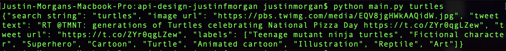

# EC500 Homework 2: API-Design

# Welcome to my Tweepy/Google Vision API!
The API design is fairly simple. Simply run the python program via "python main.py 'search term'" and replace 'search term' (keep the quotes) with whatever term you want to scour Twitter for! The program will then output a JSON containing information about the first tweet it found matching that both matched the search term and also contained an image. The JSON will contain the following information: Your search string, the image URL, the tweet text, the tweet URL, and a list of labels outputted by a Google Vision API analysis done on the image. The actual tweepVisionApi.py file can be imported just like any other api, and the functions within it can be called! Theoretically this API could be used to perform mass searches on twitter for images related to search terms, grab the google vision label data from those images, and then machine learning could be performed to recognize patterns depending on search terms (just an idea).

# Here's a photo of main.py in action:

# API Information
The tweepyVisionApi.py file contains the following functions:

searchTwitter(searchTerm): A function that uses Tweepy in order to search twitter for the first image with a tweet related to the search term (search term can be an int, string, float... but if special characters are inputted then quotes are required to force the input to be a string). The function returns a 4-value tuple (quartle?) that contains the image URL, the file name where the image is stored, the tweet text, and the tweet URl.

visionAnalysis(fileName): A function that uses the Google Vision API to analyze its input (an image file name) and outputs a list of label objects.

searchAndAnalyzeImage(keywords): A function that combines the two functions above, taking in a search term and outputting a JSON object containing all of the above information, and storing the labels in a list within the JSON.
